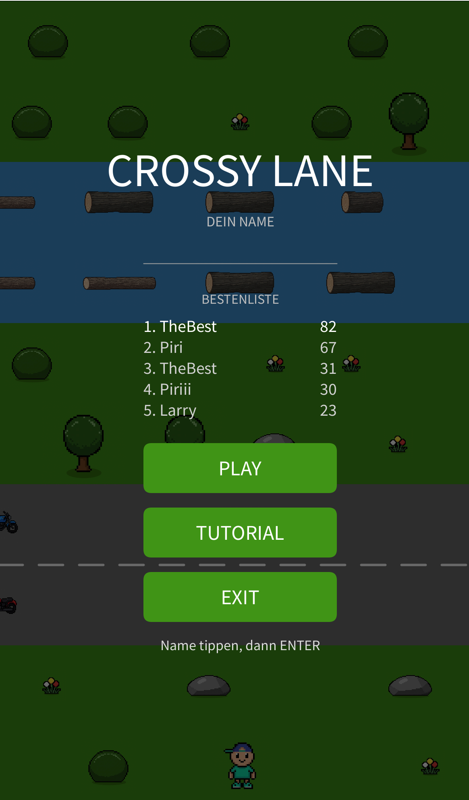
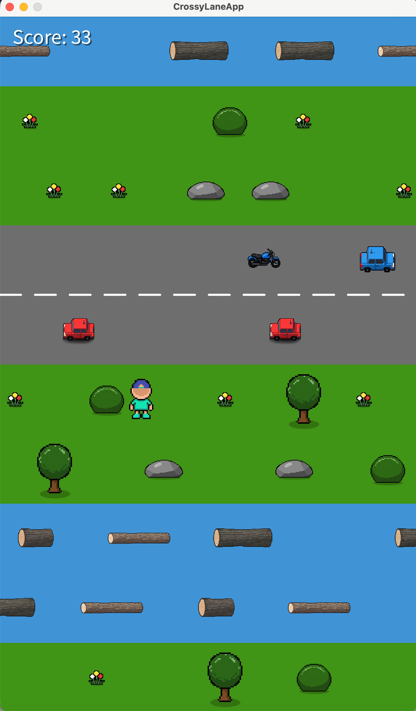
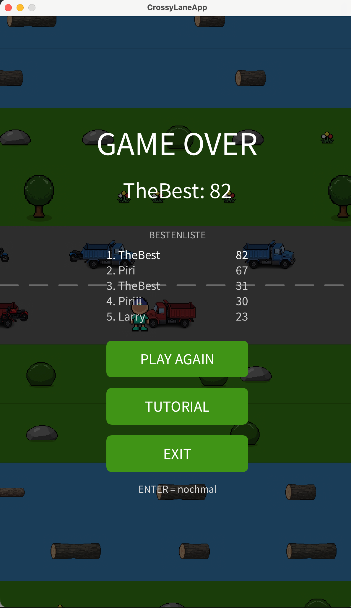
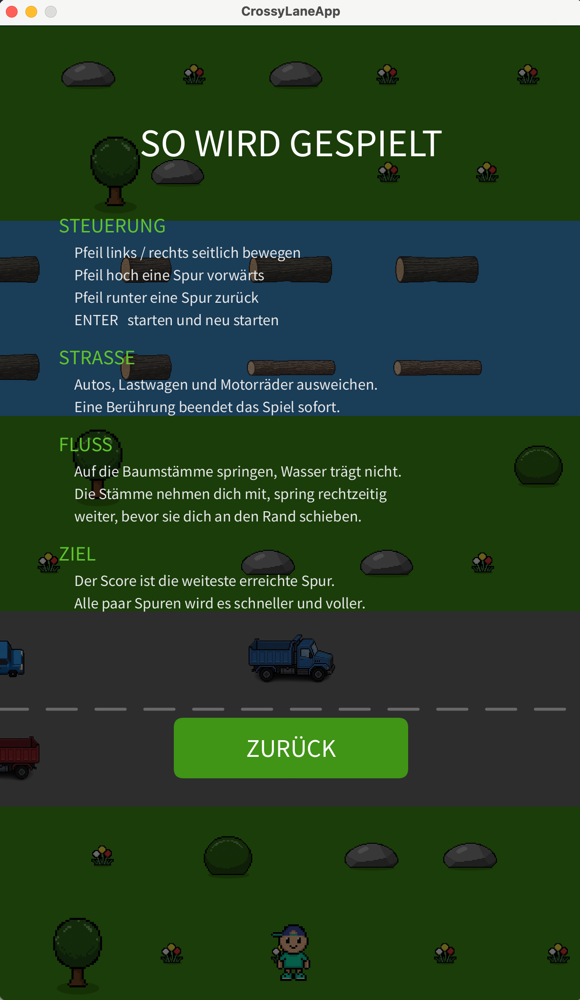

= CrossyLane – Dokumentation
:toc:
:toclevels: 2
:sectnums:

== Ziel

Das Ziel dieses Projektes ist ein CrossRoad.
Mit inspiration aus diesem Processing Spiel: https://openprocessing.org/@u115603/571637

Gespielt wird in einem Fenster von 600x1000 Pixeln.
Der Spieler springt Spur für Spur nach oben.
Dabei muss er Straßen mit Fahrzeugen und Flüsse mit Baumstämmen überqueren.
Wer weiter kommt, hat den höheren Score.
Das Spiel ist vorbei, sobald man ein Fahrzeug berührt oder im Fluss ins Wasser fällt.

== Vorgehen

Schritt 1: Initialisierung des Grundgerüsts mit 5 Lanes (evtl später mehr spurige lanes) einem Player der gegen unten und oben jumped zwischen den Lanes und auch links und rechts sich bewegen kann

Schritt 2: unlimitierte Lanes.
Mit 5 Lanes im Screen aber per runtime immer wieder neu bauende Lanes so dass man unendlich nach oben gehen kann.

Schritt 3: Bewegende hindernisse auf den Lanes platzieren mit horizontaler geschwindigkeit

Schritt 4: HitBox erkennen.
Eine kollision zwischen player und hinderniss führt zu gameOver. den GameOver screen müsste man auch erstellen.

Schritt 5: Kamera smooth mitziehen

Schritt 6: Score = höchste erreichte Lane

Schritt 7: Startscreen mit Score anzeige und play again

Schritt 8: Levels mir Random Logs und Cars und geschwindigkeit

Schritt 9: Grafiken verbessern. schönere Bilder.

Schritt 10: Animationen und Sounds, jump animations...

Schritt 11: Highscore Persistent machen lokal

Schritt 12: Tutorial im Spiel einbauen

== Schwierigkeiten

- Kamera View: da musste man zuerst schauen, wie man die kamera überhaupt will im sinn von was soll im zentrum stehen. eine Schwierigkeit war es den spieler zwar im zentrum zu stellen, aber es immernoch so auszusehen lassen, als würd sich der spieler bewegen und nicht die Map.
- Hitbox: Es gab mehrere Optionen Wie man die Hitbox checkt und wo verglichen werden soll
- BoundingBox: Ich wusste nicht wie ich die genaue Bounding Box Berechenen kann.
- GameOver: hat die die Welt nicht eingefroren wenn das spiel schon vorbei war.
- Unterschiedliche Tempos: Die Fahrzeuge hatten unterschiedliche Grössen und deshalb war der gleiche Speedfaktor aber doch nicht gleich und man sah den unterschied während dem spielen.
- Spieler auf Log: Der Spieler stand nicht perfekt auf dem log sondern es sah so aus als wäre er nur so 2d mässig mitgezogen werden.

== Lösungsweg

- Kamera View: zuerst war der Gedankengang, dass wen auf der Map die sachen sich bewegen dann wird es schon besser aussehen. aber der ansatz der auch im Inspirations Processing Game gebraucht wurde: Die kamere scrollte versetzt zum player. also mit leichtem delay zur bewegung des Spielers.
Das habe ich mithilfe KI gelöst. unzwar nimmt man ein Target X nach jedem jump und pro frame kommt man immer näher ans target
- Hitbox: Ich habe in der App Klasse es implementiert und nur die x achse in betracht gezogen und die Lane/Spur statt y achse. da man nur auf spuren jumpen kann.
Auch habe ich die methode für beide (logs und car) ausgelagert so dass für beide die Methode brauchen kann.
- Bounding Box: Die Ki hat mir im FileLoader die Berechenung gemacht.
- GameOver: Ich habe das car.update() (die berechnungen) aus dem zeichnen herausgenommen. updateWorld() als eigene Methode.
Seit dem gibt es eine klare struktur zwischen berechnungen und zeichnen.
- Unterschiedliche Tempo: Der Level-Ramp war nicht das Problem sondern es lag am TypFaktor.
Truck: 0.7 und motorrad 1.4. doppeltes Tempo zwischen zwei spuren. das musste weg. jetzt unterscheiden sich die Typen anhnad ihrer Grösse und nicht tempo.
- Spieler auf log: um halbe Spielerhöh plus halbe Stammhöhe anheben, minus 8 px damit die Füsse leicht einsinken.
Wichtig war die Stammhöhe zu nehmen weil die drei Log unterschiedlich dick sind.

== Endresultat

=== Funktionsumfang

- Die Welt scrollt endlos nach oben und wird zur Laufzeit gebaut
- Vier Spurtypen: Start, Wiese, Straße und Fluss.
Je zwei Spuren bilden einen Block
- Drei Fahrzeugarten, die sich innerhalb einer Spur mischen
- Baumstämme in drei Größen, die den Spieler mittragen
- Game Over bei Berührung eines Fahrzeugs oder wenn man im Fluss kein Log trifft
- Die Trefferflächen werden aus dem Alphakanal der Bilder berechnet
- Die Kamera zieht dem Spieler weich nach
- Drei Schwierigkeitsstufen, dazwischen steigt das Tempo laufend an
- Dekoration auf den Wiesen mit Baum, Busch, Stein und Blumen
- Der Score ist die weiteste erreichte Spur
- Bestenliste mit den besten fünf Namen, lokal in highscores.txt gespeichert
- Start, Tutorial und Game Over Screen, bedienbar mit Maus und Tastatur

== Startscreen:

== GameScreen:

== GameOver:

Tutorial Screen:

== Lernerfolge / Reflexion

- Direkt am Anfang lernte ich wie man das Projekt korekt aufsetzt.
Wie man mit modulen umgeht und wie man ein Modul aus einem anderen Repo rüberkopiert ins eigene und es dann auch zum funktionieren zu bringen. ich brauchte 2 anläufe mit der Projektaufsetzung. auch waren paar depricated Sachen im pom.xml die ich angepasst habe.

- Ich hatte am Anfang keine Ahnung wie ich beginnen möchte, und habe mir deshalb mit Claude AI einen Plan überlegt wie ich es machen will. zusammen haben wir dann einen Schritt für Schritt plan entwickelt für eine erste Version, die ich in der doku als vorgehen schonmal dokumentiert habe.
- Position in der Welt und Position auf dem Bildschirm sind zwei verschiedene Dinge.
Erst als ich die beiden getrennt hatte, funktionierte die unendliche Welt.
Die Kamera ist am Ende keine eigene Klasse, sondern nur eine Zahl, die beim Zeichnen abgezogen wird.
Autos und Baumstämme speichern gar keine senkrechte Position und scrollen deshalb automatisch mit.

- Man kann seinen eigenen Bilddateien nicht trauen. Meine Autobilder bestehen zu fast
70 Prozent aus transparentem Rand. Hätte ich die Bildbreite als Trefferfläche
genommen, wäre sie viermal zu breit gewesen. Man wäre gestorben, während das Auto noch
eine halbe Fahrbahn weg ist. Seitdem messe ich lieber nach, statt etwas anzunehmen.

